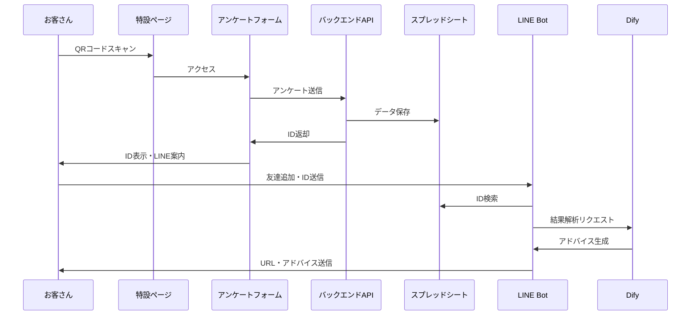

# YOXO Fes システムアーキテクチャ設計書

## 1. コンポーネント構成

### Frontend

```yaml
Frontend:
  特設ページ:
    - QRコードランディングページ
    - アンケートフォーム
    - ID表示・LINE案内画面
    - 結果表示ページ
    components:
      - QRコードスキャナー
      - フォームコントロール
      - ワンクリックコピーボタン
      - LINE連携QRコード
      - 結果ビジュアライゼーション
```

### Backend

```yaml
Backend:
  API:
    - アンケート保存API
    - ID生成API
    - 結果URL生成API
    - LINE Webhook API
  Services:
    - SpreadsheetService
    - IDGeneratorService
    - URLGeneratorService
    - DifyIntegrationService
    - LineMessageService
```

### Database

```yaml
Database:
  SpreadsheetDB:
    tables:
      - アンケート回答
      - 疲労ストレス測定結果
      - ID管理
```

## 2. データフロー



## 3. 技術スタック

```yaml
Frontend:
  Framework: Next.js
  UI Components:
    - TailwindCSS
    - shadcn/ui
  Features:
    - QRコードスキャナー
    - クリップボードAPI
    - レスポンシブデザイン

Backend:
  Server: Vercel Serverless
  API:
    - REST API
    - LINE Messaging API
  Integration:
    - Google Sheets API
    - Dify API
    - LINE API

Database:
  - Google Spreadsheet
```

## 4. セキュリティ設計

```yaml
Security:
  Authentication:
    - IDベースのアクセス制御
    - LINE認証連携
  
  Data Protection:
    - HTTPS通信
    - データ暗号化
    - アクセストークン管理

  Rate Limiting:
    - API呼び出し制限
    - スプレッドシートアクセス最適化
```

## 5. URLスキーム

```yaml
URLs:
  Landing: /yoxo-fes/
  Form: /yoxo-fes/form
  Complete: /yoxo-fes/complete?id={uniqueId}
  Result: /yoxo-fes/result/{uniqueId}
```

## 6. ID生成ロジック

```yaml
IDGenerator:
  Format: YX{timestamp}{random4}
  Example: YX202501220001
  Properties:
    - 12文字
    - プレフィックス: YX
    - タイムスタンプ: YYMMDD
    - ランダム数字: 4桁
```

## 7. LINE Bot設計

```yaml
LineBot:
  Events:
    Follow:
      - ウェルカムメッセージ送信
      - ID入力案内
    
    Message:
      - IDパターンマッチング
      - スプレッドシート検索
      - Dify API呼び出し
      - 結果URL・アドバイス送信

  Messages:
    Welcome: |
      YOXOフェスでの疲労診断ありがとうございます！
      発行されたIDを送信してください。
    
    Result: |
      あなたの診断結果はこちらです：
      {resultUrl}
      
      {difyAdvice}
```

## 8. スプレッドシート設計

```yaml
Sheets:
  Responses:
    Columns:
      - timestamp
      - id
      - q1...q16
      - calculated_scores
      
  StressData:
    Columns:
      - id
      - measured_at
      - stress_level
      - other_metrics
      
  IDMapping:
    Columns:
      - id
      - created_at
      - result_url
      - status
```

## システムの特徴

1. サーバーレスでの運用による高いスケーラビリティ
2. スプレッドシートを使用した柔軟なデータ管理
3. LINE Botによる使いやすいインターフェース
4. Difyによる高度な結果解析と個別化されたアドバイス
5. セキュアなデータ管理とアクセス制御
